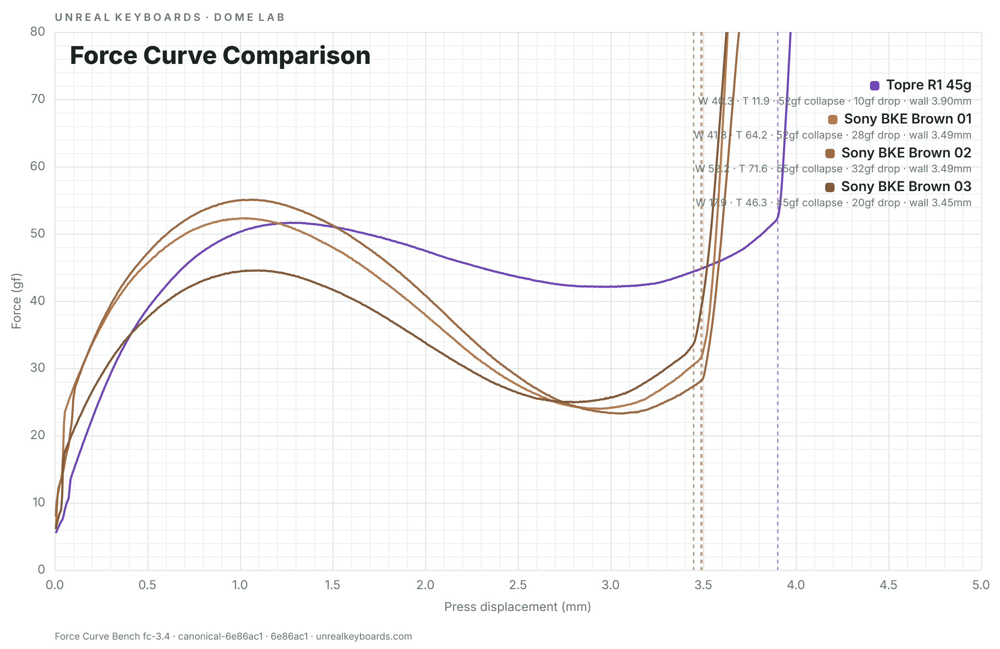

# Unreal Keyboards EC research tools

> **Current publication:** Force Curve Bench `fc-3.4` and EC Parts Builder
> `lib-6.0` are published from this repository. The active multi-tool site
> authority is `SITE_RELEASE_MANIFEST.json` with its `SHA256SUMS` inventory.

The corresponding Shopify pages present the Unreal Keyboards tools separately:

- [Dome Lab](https://unrealkeyboards.com/pages/dome-lab)
- [Force Curve Bench](https://unrealkeyboards.com/pages/topre-force-curve-library)
- [EC Parts Builder](https://unrealkeyboards.com/pages/topre-ec-parts-library-builder)
- [Beyond Snap Ratio Preprint 2.0](https://unrealkeyboards.com/pages/beyond-snap-ratio)
- [Topre & EC Dome Force Curves article](https://unrealkeyboards.com/blogs/topre-mods/topre-dome-force-curves)

Shopify owns the Dome Lab landing page, header, and navigation. Force Curve
Bench and EC Parts Builder are embedded independently. The EC Parts Builder
itself contains no Dome Lab home, tabs for other tools, or cross-tool links.

## Force Curve Bench

Force Curve Bench is an interactive viewer for measured Topre-compatible dome
and assembly force curves. It lets you inspect one retained test set, compare
several test sets on a common scale, and browse the generated measurements
behind each curve.

The bench is designed to answer practical comparison questions: which dome has
the higher collapse force, which one loses force more sharply after collapse,
where a force wall was detected, and where a dome falls within the tested
reference fleet. It does not turn those measurements into a universal good/bad
rating, and it does not treat a manufacturer's nominal weight as a measured
result.

## Release status

| Item | Status |
|---|---|
| Canonical public viewer | [https://buddyog.github.io/topre-force-curves/](https://buddyog.github.io/topre-force-curves/) |
| Generator integration and regeneration parity | Complete |
| Force Curve release tag | `fc-3.4` |
| EC Parts Builder release | `lib-6.0`; tag `ec-parts-lib-6.0`; `release_eligible: true` |
| Current public package authority | `SITE_RELEASE_MANIFEST.json` and its `SHA256SUMS` |
| Protected predecessor authority | `FORCE_CURVE_BENCH_RELEASE_MANIFEST.json`, bound to tag `fc-3.4` |
| Open Graph image | `https://buddyog.github.io/topre-force-curves/assets/force-curve-bench-fc-3.4-og.png` |
| Browser acceptance | Local interactive/runtime/export acceptance and live deployment checks recorded |
| Protected fc-3.4 surfaces | `index.html`, all 184 raw CSVs, `canonical-evidence/`, and the remaining continuity endpoints remain byte-identical |
| Frozen raw-source commit | `6e86ac1955a0c566c7aae521705e51371992ba8a` |
| Canonical evidence identity | `7aa8588b50856816b7fce90dd6e743c26c6f16926071123291cb054352b6cd4a` |
| Metric method | `metrics-v4.2` |
| Intake authority | `intake-qc-v1.4`, implementation-parity bound to `test-imp 1.1.4` |
| Perception-index model | `perception-rank-v1` |
| Research preprint | Version 2.0; [paper DOI](https://doi.org/10.5281/zenodo.22167065); [compendium DOI](https://doi.org/10.5281/zenodo.22167047) |

The site manifest records the active combined publication. The retained
`FORCE_CURVE_BENCH_RELEASE_MANIFEST.json` remains the immutable predecessor
record for the protected fc-3.4 viewer and evidence surfaces.

The accepted second GUI update changes presentation and navigation only. The
frozen scientific payload, run membership, measurements, method, and index
equations did not change.

The lib-6.0 site release replaces only `dome-lab-parts.html` with the generated
builder. Every other protected predecessor endpoint, every raw CSV, and the
complete canonical-evidence tree remain byte-identical to fc-3.4. The
deterministic site builder rejects any undeclared or protected-path change.

The release adds a root `.gitattributes` containing exactly `* -text`. This
disables Git text and line-ending normalization for every inventoried path so a
checkout cannot silently rewrite sealed bytes on Windows or another platform.
It also adds an empty root `.nojekyll`, which makes GitHub Pages publish the
tree directly without Jekyll filtering underscore-prefixed paths. Both files
are publication infrastructure, not raw-source files or part of the canonical
scientific evidence.

## EC Parts Builder

The published `lib-6.0` build is one row-based assembly tool. Its catalog
feeds contextual part choosers rather than a separate library page. It exposes
9 component rows, 13 source-backed keyboard starters, 68 exact dome-specimen
measurement mappings carrying measured collapse force plus released Weight
Index and Tactility Index values, and 2 public keycap additions from the larger
vendored catalog.

The consumer payload contains 338 decision-changing compatibility edges. The
complete 3,403-edge configuration remains the audit authority outside the
browser. Public results use exactly **Works**, **Works with conditions**,
**Does not work**, and **Not verified**. Dome compatibility is outside this
engine and is labeled **Not evaluated**.

See the [EC Parts Builder guide](documentation/EC_PARTS_LIBRARY.md),
[lib-6.0 release notes](documentation/RELEASE_NOTES_lib-6.0.md), and
[Shopify embed contract](documentation/SHOPIFY_EMBED.md).

## What the viewer can do

- Plot the averaged press and return traces for a retained test set.
- Use one shared fleet-wide absolute displacement axis for every curve
  comparison. The normal endpoint is 4.0 mm; this fleet uses 4.5 mm because one
  released force-wall marker is slightly beyond 4.0 mm. Recorded turnaround
  does not enlarge the axis.
- Browse dome tests and part-assembly tests in separate **Domes** and **Parts**
  workspaces, and compare up to 10 compatible tests at once.
- Narrow the Domes sidebar by name, Weight Index, Tactility Index, collapse
  force, or Snap %, with tests organized under collapsible brand and variant
  groups. Nested family members are filtered as individual records.
- Show weight-family and tactility-family comparison profiles on a
  shared percentile scale.
- Plot Weight Index against Tactility Index for calibrated domes.
- Browse and sort all generated test records, with name, category, and numeric
  range filters.
- Show exact chart readings with a mouse, touch screen, or pen.
- Keep the current comparison in the page URL so it can be shared.
- Export an evidence-stamped PNG of any available chart mode with a faint,
  centered **UNREAL KEYBOARDS** watermark.
- Fall back to embedded curve snapshots if the pinned raw files cannot be read
  from the network.

See the [Viewer Guide](documentation/VIEWER_GUIDE.md) for step-by-step use.

## Quick start

1. Open [Force Curve Bench](https://buddyog.github.io/topre-force-curves/).
2. Choose **Domes** or **Parts**, expand a brand, and select a test. Use the
   sidebar search if needed; **Metric filters** are also available in Domes.
3. Choose additional tests to compare. Switching between **Domes** and
   **Parts** clears an incompatible selection because the two record kinds are
   intentionally kept separate.
4. With two or more tests selected, switch among **Force curves**, **Weight
   profile**, **Tactility profile**, and **Weight vs tactility**.
5. Hover over the chart for exact readings, or tap it on a touch device.
6. Copy the address bar to share the current selection, or choose **Export
   PNG** to save the current chart.

The viewer limits a comparison to 10 tests to keep the color-coded series and
readout legible. Remove one selection before adding an 11th.

## What the main measurements mean

The viewer groups mechanical descriptors by the aspect of the pilot in which
they had the strongest observed associations. That grouping is useful for
comparison, but it does not prove that every descriptor independently causes a
particular perception.

### Weight-family descriptors

- **Collapse force** is the detected mechanical collapse peak, measured in
  gram-force (gf).
- **Ramp** describes the pre-collapse force buildup over the baseline-relative
  10–90% rise, after excluding the seating transient, in gf/mm.
- **Pre-collapse work** is the one-way mechanical work integral from the start
  of the press to collapse, in gf·mm.

### Tactility-family descriptors

- **Drop** is collapse force minus valley force, in gf.
- **Steepest 0.10 mm drop** is the fastest force loss over any 0.10 mm window
  between collapse and valley, in gf/mm.
- **Drop rate** divides force drop by the collapse-to-valley distance, in
  gf/mm.
- **Snap %** is force drop divided by collapse force, multiplied by 100.

### Detected force-wall onset

Detected force-wall onset is an operational result from the complete measured
assembly. It is not nominal dome height, physical switch travel, actuation
travel, or a universal contact position. The viewer reports the measured onset
and marks it on the curve.

The **recorded turnaround range (test limit)** is separate. It only reports how
far the retained acquisitions were recorded. It is never substituted for a
force wall. If the wall rule is not satisfied, the viewer says **Not
detected**.

Displayed mechanical scalar values come from full-precision per-run results and
the declared cohort-aggregation rule. The two perception indices use
full-precision cohort aggregates and frozen reference arrays. Rounding occurs
only for presentation. The displayed visualization trace is averaged
separately, so a scalar marker does not have to land exactly on a feature of
the averaged line.

## Weight and tactility indices

**Weight Index** is the percentile of a dome's collapse force compared with the
other domes tested, from 0 (lightest) to 100 (heaviest).

**Tactility Index** is the percentile of a dome's force drop compared with the
other domes tested, from 0 (least sharp) to 100 (sharpest).

They are not predicted 1–10 ratings, universal perceptual units, or proof that
one dome will feel the same to every person or in every keyboard. The full
calculation is specified in [`documentation/METHOD.md`](documentation/METHOD.md#pilot-derived-perception-indices).

The mechanical inputs were selected because collapse force and force drop had
the strongest observed rank associations with the pilot's perceived-weight
and tactility-sharpness scores. The pilot used one rater, 25 domes, and three
fixed-order sessions. It contained no linear/off observation, so a low
Tactility Index does not classify a dome as linear. Part-assembly
records are outside the calibrated reference population and display **Not
calibrated**. Force-wall onset is not part of either index.

## Evidence and trace sources

The current frozen evidence contains:

- 76 semantic test records;
- 75 independent measurement cohorts;
- 184 semantic raw-run bindings representing 180 unique acquisitions; and
- 68 release-eligible dome-baseline cohorts in the index reference fleet.

One group of acquisitions intentionally has both a dome interpretation and a
part-assembly interpretation. Those records describe different meanings but
are not independent physical tests. The viewer exposes record IDs, source sets,
and measurement cohorts so this relationship is not hidden.

At runtime the viewer first attempts to fetch retained raw CSV traces from the
exact frozen commit. Here, “live” means a current read of immutable,
commit-pinned bytes; it does not mean the latest mutable branch. If that read
fails or times out, the viewer uses its embedded snapshot traces and displays a
snapshot notice. Generated scalar measurements are the same in both modes and
are never recomputed from the downloaded or embedded averaged curve.

The selectable fleet is generated in advance. Uploading a new folder or
changing a branch cannot silently add a test to an existing viewer build.

## Data acceptance in brief

Raw runs are admitted through `intake-qc-v1.4`, which is bound to the accepted
`test-imp 1.1.4` implementation. The intake sequence checks parsing and
trajectory integrity, signal integrity, hard speed and cadence limits,
landmark validity, mixed replicate-supported populations, replicate agreement,
and a minimum of two matching retained runs. A retained-cohort RAMP review is
advisory only; it does not alter membership or measurements.

These checks are engineering intake guardrails. They are not manufacturer
tolerances, formal instrument-uncertainty bounds, or perceptual thresholds.

## Status labels

- **Not detected** — the force-wall rule did not find a wall. The viewer does
  not replace it with the last sample.
- **Not available** — that measurement is missing or cannot be defined for the
  record. The viewer does not invent a value.
- **Not calibrated** — a perception index is intentionally not assigned to a
  part-assembly record.

## Documentation

- [Viewer Guide](documentation/VIEWER_GUIDE.md) — selecting, comparing,
  filtering, sharing, reading, and exporting.
- [Measurement and calculation method](documentation/METHOD.md) — acquisition,
  intake, aggregation, metric, and index rules.
- [Limitations and interpretation boundaries](documentation/LIMITATIONS.md) —
  what the measurements and indices do and do not establish.
- [Data and provenance](documentation/DATA_PROVENANCE.md) — frozen identities,
  population counts, metadata lineage, aliases, and authoritative artifacts.
- [Reproduction and verification](documentation/REPRODUCING.md) — package
  verification and conditional full regeneration.
- [Browser acceptance](documentation/BROWSER_ACCEPTANCE.md) — interactive,
  runtime-battery, export, and responsive acceptance evidence.
- [Future data updates](documentation/DATA_UPDATES.md) — the versioned path for
  adding tests, retests, corrections, or folder renames without silently
  changing a released dataset.
- [Third-party font notice](documentation/THIRD_PARTY_NOTICES.md) — embedded
  font credits and SIL Open Font License 1.1 terms.
- [Subjective pilot](documentation/subjective-pilot/README.md) — protocol,
  source identity, observations, summaries, correlations, and limitations.
- [fc-3.4 release notes](documentation/RELEASE_NOTES_fc-3.4.md) — viewer
  changes, release-integration corrections, scientific continuity, and
  publication identity.
- [EC Parts Builder guide](documentation/EC_PARTS_LIBRARY.md) — standalone
  workflow, contextual catalog, Evidence-beta labels, and interpretation limits.
- [lib-6.0 release notes](documentation/RELEASE_NOTES_lib-6.0.md) — local-review
  chronology, target identity, changes, limitations, and verification contract.
- [Shopify embed contract](documentation/SHOPIFY_EMBED.md) — exact-origin
  parent/child messaging and production acceptance checks.
- [Public release record](documentation/PUBLIC_RELEASE.md) — final public
  URLs, released identities, paper hashes, licensing boundary, and rollback
  retention.
- [Citation guide](documentation/CITATION.md) — citations for the paper,
  compendium, tools, and measurement records.
- [Prospective multi-rater study](documentation/prospective-study/README.md) —
  frozen `perception-validation-v1` protocol, plain-language SOP, participant
  script, analysis plan, data templates, and blinded schedule generator.
- [Full-paper roadmap](documentation/research-paper/README.md) — how Preprint
  2.0, the exploratory pilot, and future validation results become the full
  manuscript without mixing evidence classes.
- [Perception-validation v1 freeze notes](documentation/RELEASE_NOTES_perception-validation-v1.md)
  — frozen design, operator materials, readiness boundary, and scientific
  continuity.

## Scope and limitations

- Results describe the tested specimen and measured assembly. Identical-looking
  domes can differ.
- A family average is a visualization aid, not an independently measured dome
  record, and therefore has no generated scalar measurements.
- Individual retained runs are preserved in the evidence, but the consumer
  viewer treats the averaged retained set as the displayed result.
- Percentile indices are relative to a frozen fleet. A future fleet or method
  version requires a new versioned reference and may change ranks.
- This tool supports comparison; it does not recommend a universally “best”
  dome.

## Rights and reuse

© 2026 Brian “BuddyOG” Gebo — Unreal Keyboards. All rights reserved.

The owner permits sharing unmodified charts exported by Force Curve Bench and
unmodified data files published with the repository when the share includes
attribution to **BuddyOG / Unreal Keyboards** and a link to the repository or
the canonical live viewer. This is limited sharing permission, not an open
license or a broader grant for the software, documentation, or data. It does
not permit relicensing or imply endorsement.

Inter and IBM Plex Mono are embedded third-party fonts licensed separately
under the SIL Open Font License 1.1. See the
[third-party font notice](documentation/THIRD_PARTY_NOTICES.md). Their licenses
do not change the project terms above.

## Credits

- **Measurement-rig design:**
  [bluepylons/Open-Switch-Curve-Meter](https://github.com/bluepylons/Open-Switch-Curve-Meter).
- **Testing, data stewardship, analysis, and Force Curve Bench:** Brian
  “BuddyOG” Gebo / [Unreal Keyboards](https://unrealkeyboards.com).

The released EC Parts Builder consumes the fc-3.4 canonical evidence without
changing it. Beyond Snap Ratio Preprint 2.0 records the released methods and
exploratory pilot. The prospective blinded multi-rater protocol is frozen as
`perception-validation-v1`; until the study is completed, no confirmatory
multi-rater perception claim is made.
